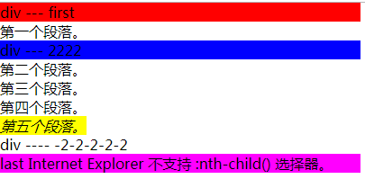
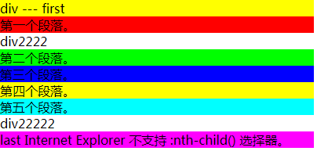

# nth-child
 1. `nth-child(x)`  `x` 为父级标签下的`所有子标签`的**位序 | 并且符合前缀标准的**
 ```
  <body>
    <style>
      .box1 .pEle:nth-child(1) {
        background: #FF0000;
      }
      .box1 .pEle:nth-child(2) {
        background: #00FF00;
      }
      .box1 .pEle:nth-child(3) {
        background: #0000FF;
      }
      .box1 :nth-last-child(3) {
        background: #FFFF00;
      }
      .box1 .pEle:nth-last-child(2) {
        background: #00FFFF;
      }
      .box1 .pEle:last-child {
        background: #FF00FF;
      }
    </style>
    <div class="box1">
      <div class="pEle">div --- first</div>
      <p>第一个段落。</p>
      <div class="pEle">div --- 2222</div>
      <p class="pEle">第二个段落。</p>
      <p class="pEle">第三个段落。</p>
      <p class="pEle">第四个段落。</p>
      <i class="pEle">第五个段落。</i>
      <div>div ---- -2-2-2-2-2</div>
      <p class="pEle">last Internet Explorer 不支持 :nth-child() 选择器。</p>
    </div>
  </body>
 ```
 

# nth-of-type
 2. .nth-of-type(x)  `x` 为父级标签下的`各类子标签单独分组`的**位序 | 并且符合前缀标准的**
 ```
  <body>
    <style>
      .box2 p.pEle:first-of-type {
        background: #FF0000;
      }
      .box2 p.pEle:nth-of-type(2) {
        background: #00FF00;
      }
      .box2 p.pEle:nth-of-type(3) {
        background: #0000FF;
      }
      .box2 :nth-last-of-type(3) {
        background: #FFFF00;
      }
      .box2 p.pEle:nth-last-of-type(2) {
        background: #00FFFF;
      }
      .box2 p.pEle:last-of-type {
        background: #FF00FF;
      }
    </style>
    <div class="box2">
      <div class="pEle">div --- first</div>
      <p class="pEle">第一个段落。</p>
      <div>div2222</div>
      <p class="pEle">第二个段落。</p>
      <p class="pEle">第三个段落。</p>
      <p class="pEle">第四个段落。</p>
      <p class="pEle">第五个段落。</p>
      <div>div22222</div>
      <p class="pEle">last Internet Explorer 不支持 :nth-child() 选择器。</p>
    </div>
  </body>
 ```
 