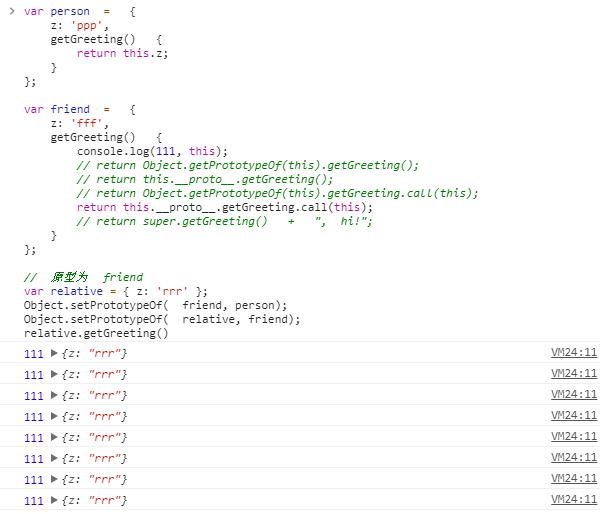

# es6
### super

+ 在	ES6	之前，“方法”的概念从未被正式定义，它此前仅指对象的函数属性（而非数据属性）。	ES6	则正式做出了定义：方法是一个拥有 `[[HomeObject]]` 内部属性的函数，此内部属性指向该方法所属的对象。

+ 任何对 `super` 的引用都会使用 `[[HomeObject]]` 属性来判断要做什么。第一步是在 `[[HomeObject]]` 上调用 `Object.getPrototypeOf()` 来获取对原型的引用；接下来，在该原型上查找同名函数；最后，创建 `this` 绑定并调用该方法。

+ `super` 引用**并非是动态的**，它总是能指向正确的对象。在本例中， 
`friend.getGreeting()` 的 `[[HomeObject]]` 值是 `friend` ， `super.getGreeting()` 总是指向 `person.getGreeting()` ，而不管有多少对象继承了此方法。

